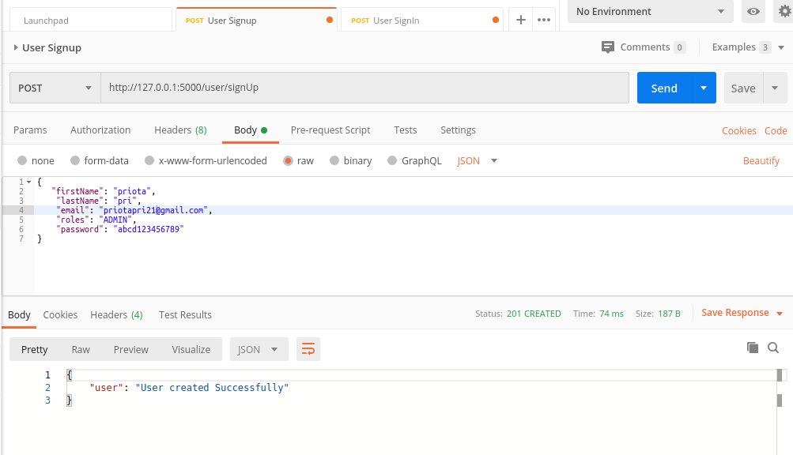
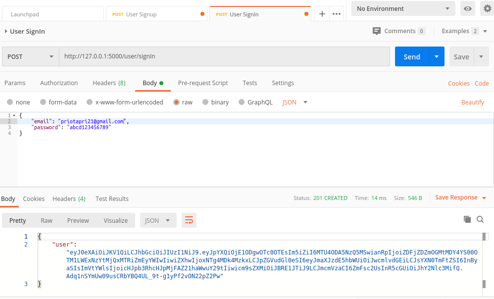
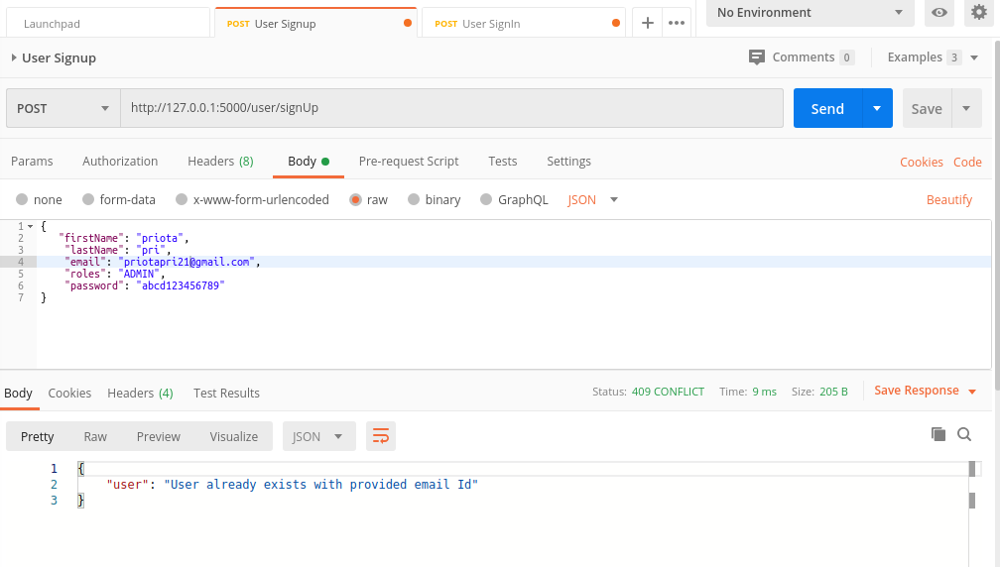
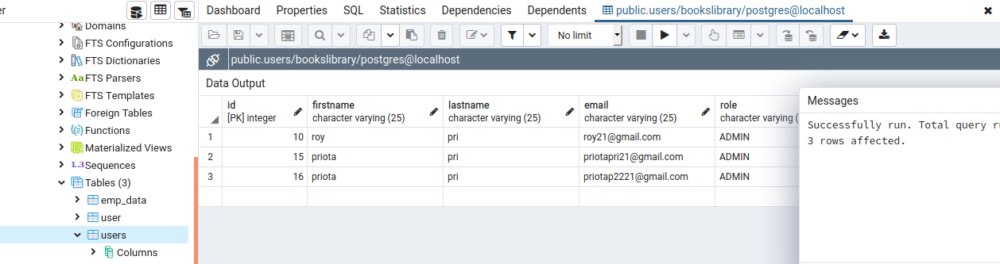

# USER AUTHENTICATION WITH SQLALCHEMY
##### Here i make some simple api for validate user authentication service.
___

Here I use :
* SQLALCHEMY
* Python-FLASK
* docker
* postman
* POSTGRESQL
___

here is some screenshot of my system: 
  
  
  
 
 
___
